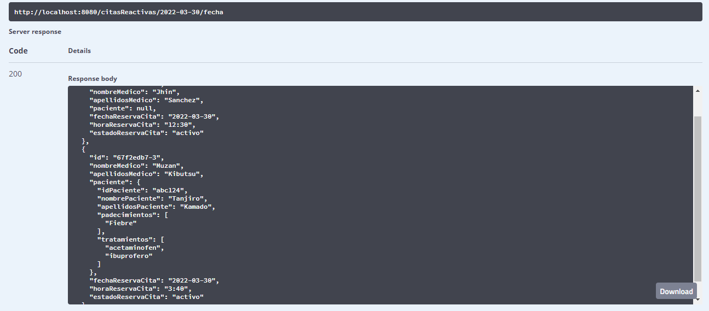

"# clinica-spring-mongoDB"
"# clinicacitas-spring-mongoDB"
"# appCitas-spring-mongoDB"
"# appCitas-spring-mongoDB"
"# appCitas-spring-mongoDB"
"# appCitas-spring-reactivo-mongoDB"

#Aplicación de citas docoumentada con swagger y deploy en heroku

### _Maycol Steven Rincon_

Se realizó cambios en la estructura de la base de datos, para permitir tener
informacion adicional del paciente, se agregó padecimientos y tratamientos.

Permite cambiar el estado de la cita a cancelado.

Consultar el nombre y el apellido del medico a partir del id de la cita.

Consultar fecha, hora y fecha-hora.

Deploy en heroku

## Captures

Ingreso de fecha:

Respuesta dos citas con la misma fecha

Ingreso fecha y hora

Respuesta de una sola cita con esa fecha y hora especificas

